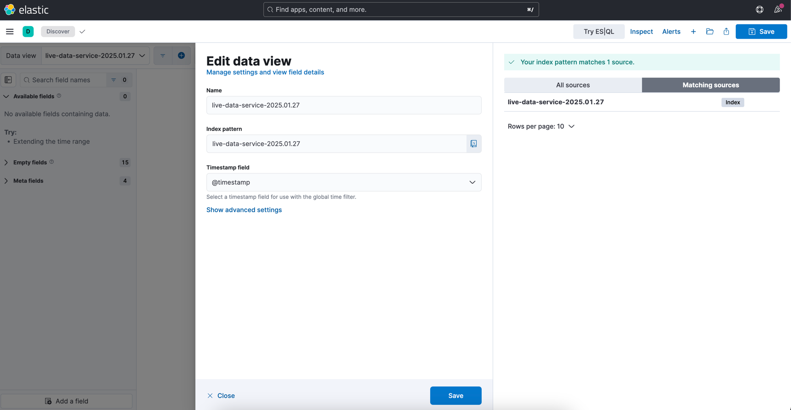
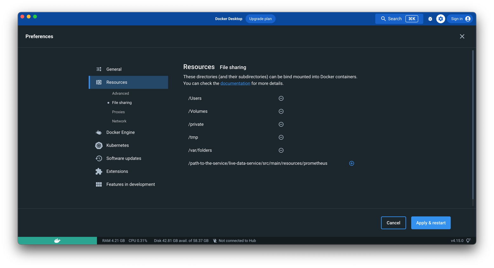

<!-- TABLE OF CONTENTS -->
<details open="open">
  <summary><h2 style="display: inline-block">Table of Contents</h2></summary>
  <ol>
    <li><a href="#Summary">Summary</a></li>
    <li><a href="#Prerequisites">Prerequisites and Installation</a></li>
    <li><a href="#Tech_Stack">Tech Stack</a></li>
    <li><a href="#How_To_Run_And_Test_Application">How To Run And Test Application</a></li>
    <li><a href="#How_To_Run_And_Test_Dockerfile">How To Run And Test Application with Dockerfile (OPTIONAL)</a></li>
    <li><a href="#How_To_Run_And_Test_Docker_Compose">How To Run And Test Application with docker-compose.yml (OPTIONAL)</a></li>
    <li><a href="#Redis">Redis Commands</a></li>
    <li><a href="#Google_Play_Integrity_API">Google Play Integrity API</a></li>
    <li><a href="#References">References</a></li>
  </ol>
</details>

-------

### Summary

#### live-data-service is providing CRUD operations to process live events

-------

### Prerequisites

- `Java 21+` needs to be installed `export JAVA_HOME=$(/usr/libexec/java_home -v 21)`
- `Maven` needs to be installed
- `Docker` needs to be installed
- Install any Java IDE (`Eclipse`, `STS`, `Intellij` etc..) and ensure you are able to launch
- Clone or checkout the project from version control system (`git`) and follow below steps

-------

### Tech_Stack

- `Java 21`
- `Spring Boot 3`
- `H2 Database` (Default values are provided below)
    - `Default H2 Database Url`: http://localhost:8080/h2-console
    - `username`: `sa`
    - `password`: `sa`
    - `url`: `jdbc:h2:mem:MB_TEST;DB_CLOSE_DELAY=-1`
- `Swagger`: http://localhost:8080/swagger-ui/index.html
- `Flyway` for database migration
- Centralize exception handling by `ControllerAdvice`
- `Mapstruct` to map different type of objects to each other
- `Micrometer` dependencies were added to track the logs easily
- `Testcontainers` dependencies were added for integration tests
- `docker-compose.yml` contains `Grafana`, `Prometheus` and `Zipkin` to track metrics, `Kafka` for event-driven
  architecture, `Redis` for caching, `Elasticsearch`, `Kibana`, and `Logstash` for search, analytics engine and logs,
  `PostgreSQL` and `MongoDB` for data storage.
    - Kafka and its UI are included for message streaming, while the Elastic Stack (Elasticsearch, Logstash, Kibana) is
      set up for log management and visualization.
    - All services are connected through `bridge` networks, ensuring communication between containers.
    - `Actuator`: http://localhost:8080/actuator
    - `Kafka UI`: http://localhost:9999/
    - `Grafana`
        - Login Credentials
            - Url: http://localhost:3000/
            - Email or username: `admin`
            - Password: `admin`
        - Add `Prometheus` Datasource
            - Url: http://host.docker.internal:9090
        - Add Dashboards
            - https://grafana.com/grafana/dashboards/4701-jvm-micrometer/
            - https://grafana.com/grafana/dashboards/5373-micrometer-spring-throughput/
    - `Prometheus`
        - `Actuator`: http://localhost:8080/actuator/prometheus
        - `Prometheus`: http://localhost:9090/graph
    - `Zipkin UI`: http://localhost:9411
    - `Elasticsearch`: http://localhost:9200/
    - `Kibana`: http://localhost:5601/app/home#/
        - Connect Spring Boot to `Elasticsearch` `(TESTED FOR SPRING BOOT 3)`
        - Run Spring Boot project
        - Open http://localhost:5601/app/home#/ --> `Discover` --> `Create data view` -> `Name should be Index name` -->
          `Save date view to Kibana`
            - 
    - `Database credentials`
        - `PostgreSQL`
            - `url`: `jdbc:postgresql://localhost:5432/localdb`
            - `username`: `test`
            - `password`: `test`
        - `MongoDB`
            - `url`: `mongodb://localhost:27017/testdb?authSource=admin`
            - `username`: `root`
            - `password`: `example`

- Test via `Postman` (OPTIONAL):
    1. Import [Postman Collection](docs%2Funit_test_service.postman_collection.json)
    2. Right-click the imported Postman Collection and click _**Run Collection**_ section.
    3. On the right panel choose _**Functional**_ or _**Performance**_ section, edit _**Run configuration**_ and click
       _**run**_ to test the application.

-------

### How_To_Run_And_Test_Application

- Please follow the following steps, if you want to build and run Spring Boot Application

```
*** Run the application by following these steps.

1 - cd live-data-service
2 - docker-compose up -d
3 - ./mvnw clean install or mvn clean install or mvn clean package 
4 - ./mvnw spring-boot:run or mvn spring-boot:run
```

-------

### How_To_Run_And_Test_Dockerfile

- Please follow the following steps, if you want to build and run Dockerfile

```
1 - cd live-data-service
2 - docker-compose up -d
3 - ./mvnw clean install or mvn clean install or mvn clean package --------THIS IS MUST---------
4 - docker build -t mb/live-data-service .
5 - docker run -p 8080:8080 mb/live-data-service
```

-------

### How_To_Run_And_Test_Docker_Compose

- Please follow the following steps, if you want to build and run `docker-compose.yml`
- Remove `live-data-service` service comment in `services` section in `docker-compose.yml`
- `Docker` -> `Preferences` -> `Resources` -> `File sharing` -> click add button and select `prometheus` folder under
  the `/src/main/resources` or just add `/etc/prometheus` path -> `Apply & Restart`
    - 

```
1 - cd live-data-service
2 - ./mvnw clean install or mvn clean install or mvn clean package --------THIS IS MUST---------
3 - docker build -t mb/live-data-service .
4 - docker-compose up -d
```

-------

### Redis

- The following command returns all matched data by `'keyPattern:*'` pattern
    - `redis-cli --scan --pattern 'keyPattern:*'`

- The following command deletes all matched data by `'keyPattern:*'` pattern
    - `redis-cli KEYS 'keyPattern:*' | xargs redis-cli DEL`

- The following command finds `TYPE` in redis with `KEY`
    - `TYPE key` -> `TYPE xxx:hashedIdOrSomethingElse`

- The following commands search by `TYPE`
    - for `"string" TYPE`: `get key`
    - for `"hash" TYPE`: `hgetall key`
    - for `"list" TYPE`: `lrange key 0 -1`
    - for `"set" TYPE`: `smembers key`
    - for `"zset" TYPE`: `zrange key 0 -1 withScores`

- `RedisInsight`: http://localhost:8001/

-------

### Google_Play_Integrity_API

- [Setup Firebase](https://firebase.google.com/docs/admin/setup) or Just follow the following steps
  to [Initialize the SDK, Create and Download Firebase Credentials JSON File](https://firebase.google.com/docs/admin/setup#initialize-sdk)
    - After JSON file is downloaded, copy the content of downloaded file and replace `play-integrity-credentials.json`
      content with that copied text
    - Replace `application-name` value in application.yml file with `project_id` variable that is
      in `play-integrity-credentials.json`
    - [HELPFUL LINK BUT IT SHOULD NOT BE NEEDED](https://stackoverflow.com/a/40799378)

-------

### References

- [Metrics Made Easy Via Spring Actuator, Docker, Prometheus, and Grafana](https://www.youtube.com/watch?v=Utv7MWgNTvI)
- https://prometheus.io/docs/prometheus/latest/installation/#volumes-bind-mount
- [Spring Boot Rest Controller Unit Test with @WebMvcTest](https://www.bezkoder.com/spring-boot-webmvctest/)
- [Redis Commands](https://auth0.com/blog/introduction-to-redis-install-cli-commands-and-data-types/)
- [Running RedisInsight using Docker Compose](https://collabnix.com/running-redisinsight-using-docker-compose/)
- [Google Play Integrity API](https://developer.android.com/google/play/integrity)
- [A Guide to Querydsl with JPA](https://www.baeldung.com/querydsl-with-jpa-tutorial)